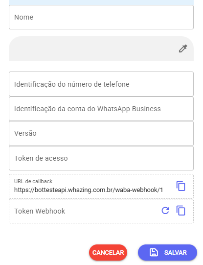
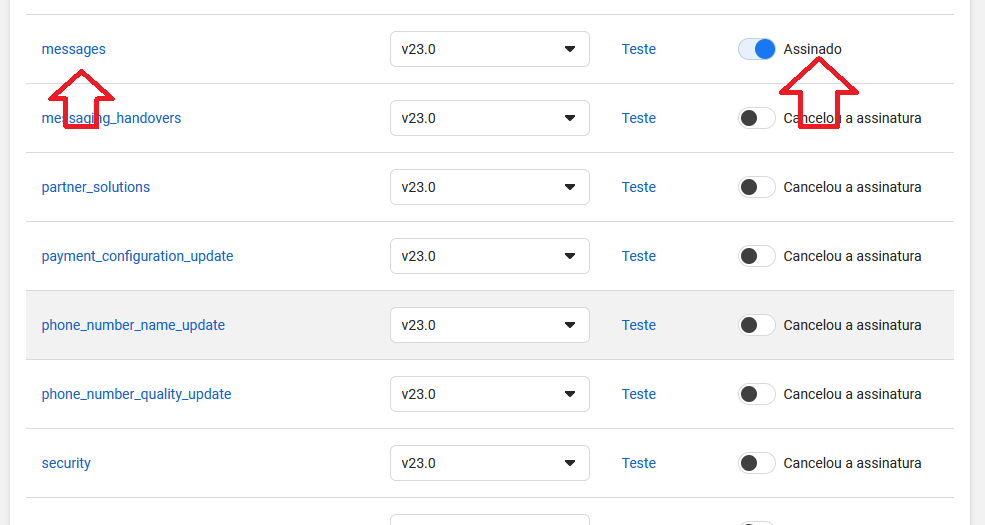
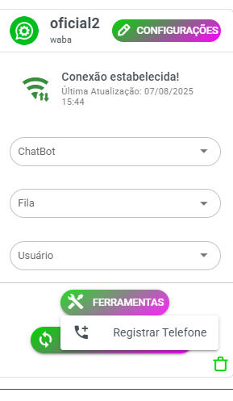
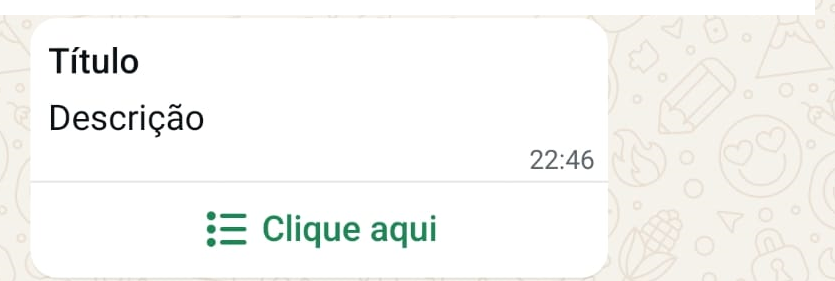
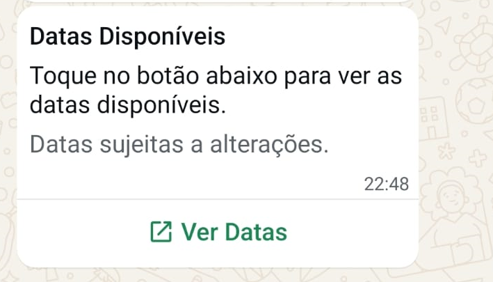
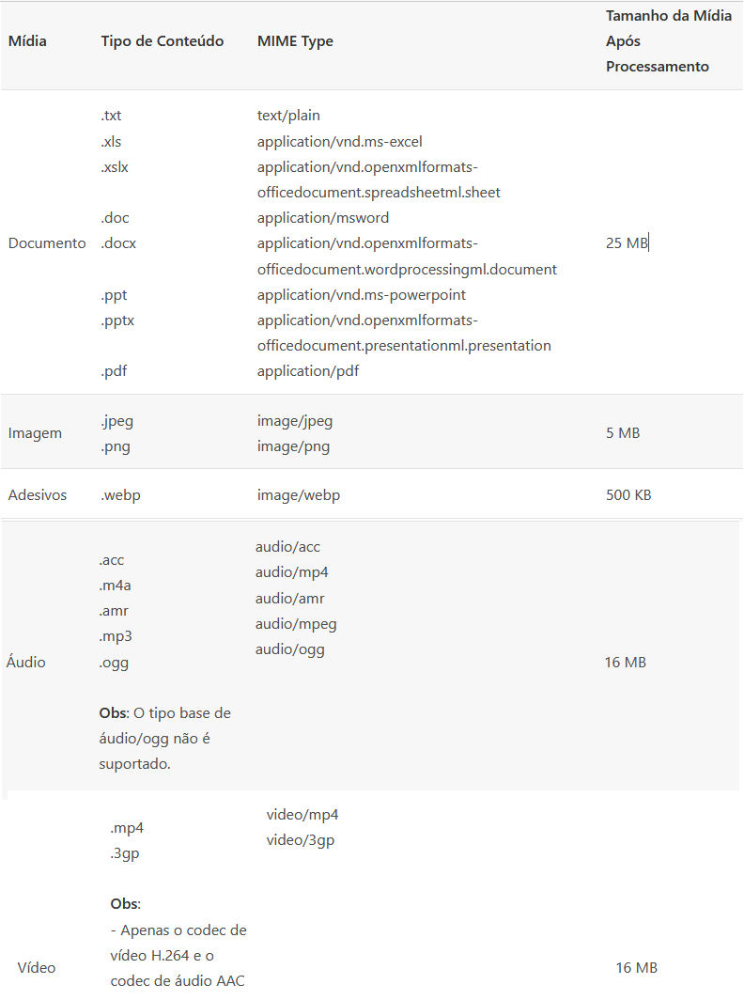
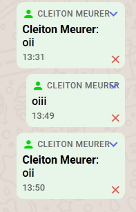

# ✅ Manual de Integração com a API Oficial do WhatsApp (Meta)

Este guia ensina como integrar a API oficial do WhatsApp com o sistema **Whazing**.

---

## 1. Acesse o Painel da Meta

- Acesse: https://developers.facebook.com/  
- Faça login com sua conta do Facebook.  
- Clique em **"Criar aplicativo"**.  
- Selecione o tipo **"Outro"** e depois **"Empresa"**.

---

## 2. Configurar WhatsApp

- No quadro do WhatsApp, clique em **"Configurar"**.  
- Selecione uma empresa vinculada à sua conta.  
  > Se ainda não tiver uma empresa, será necessário **cadastrar**.

- Clique em **"Começar a usar a API"**.

---

## 3. Ajustes Iniciais do Aplicativo

- Vá para **Configurações do App > Básico**  
- Preencha os seguintes campos obrigatórios:
  - **URL da Política de Privacidade**
  - **URL dos Termos de Serviço**

- Clique em **Salvar alterações**.

- No topo da página, altere o status do app de **"Em desenvolvimento"** para **"Ativo"**.

---

## 4. Configuração da API do WhatsApp

- No menu lateral, vá em **WhatsApp > Configuração da API**  
- Na **Etapa 5**, clique em **"Adicionar número de telefone"**.  
- Preencha os dados solicitados e conclua as validações necessárias.

---

## 5. Gerar Token Temporário

- Ainda na tela de Configuração da API, gere um **Token de Acesso Temporário** e copie.

---

## 6. Adicionar Canal no Whazing

- No Whazing, vá em **Adicionar Canal** e selecione a opção **"WABA API Oficial"**

- No campo **Token de Acesso**, cole o token temporário que você gerou:

- Também será necessário copiar os seguintes dados da tela de configuração da API:
  - **Identificação do número de telefone**
  - **Identificação da conta do WhatsApp Business**
  - **Versão da API** (Ex: `v22.0`, ou use a mais recente como `v23.0`)

---

## 7. Configurar Webhook

- Ainda no painel da Meta, vá para **Configuração da API > Etapa 3: Configure Webhooks**
- No Whazing, clique em **Gerar Token de Webhook** e copie o token e a URL de Callback.
- Volte na tela da Meta e clique em **Configurar Webhook**.
- Preencha com os dados copiados e clique em **"Verificar e Salvar"**.
- Role a página até encontrar **"messages"** e mude o status para **Assinado**:

---

## 8. Registrar Telefone no Whazing

- Acesse **Ferramentas > Registrar Telefone**

- Digite um **PIN de 6 dígitos** (se já usou um antes, repita o mesmo PIN).

---

## 9. Gerar Token Permanente

O token temporário expira. Para continuar utilizando a API, gere um **Token Permanente**:

👉 Guia oficial:  
https://developers.facebook.com/docs/whatsapp/business-management-api/get-started#1--acquire-an-access-token-using-a-system-user-or-facebook-login

---

## 10. Atualizar Token no Whazing

- Após gerar o token permanente, volte no canal do Whazing e substitua o **Token de Acesso** pelo novo token gerado.

---

✅ **Pronto! Agora seu sistema está integrado com a API Oficial do WhatsApp.**

# SUPORTE API OFICIAL VIA HUB

A API oficial está disponível tanto na **versão gratuita** quanto para **clientes Premium**.

---

### 💵 Valores

- **Taxa de ativação do canal oficial:** R$ 120,00  
- Após ativado, **não poderá ser excluído**. Caso seja, a taxa de ativação será **perdida**.
- Em caso de **banimento do número**, a taxa de ativação também é **perdida** — sim, a API oficial **também pode ser banida**.
- Mensalidade de uso do Hub: **clientes Premium têm valor especial**.

---

### ⚠️ Considerações importantes

- É possível conectar a API oficial e manter o aplicativo do WhatsApp no celular (**recurso em fase Beta**).
- Após conectar com a API oficial, **não será mais possível usar a API não oficial**.  

- A API oficial **não oferece suporte a grupos**. O acesso será apenas pelo app ou WhatsApp Web. Grupos possivel acessar atraves baileys no whazing.
- O envio de templates está configurado
  ➤ [Tabela oficial de preços da Meta](https://business.whatsapp.com/products/platform-pricing?lang=pt_BR&country=Brasil&currency=D%C3%B3lar%20(USD)&category=Utilit%C3%A1rios)
- A API oficial **não exibe a foto do contato**.
- Mensagens enviadas via app ou Web **não geram custo**.
- Você tem **24 horas** para responder uma mensagem do cliente via Whazing.

- No modo qrcode tem algumas mensagens que não chegam na api oficial, somente aparece no celular

---

### ✅ Whazing tem suporte às mensagens especiais da API OFICIAL

- **Botões (até 3)**  
  

- **Lista**  
    
  

- **Links com informações**  
  
  
- **Solicitar localização**  
  

---

### 📤 Por onde posso enviar essas mensagens?

- **Bot Interno**: Totalmente personalizável.
- **Typebot**:
  - Até 3 botões → serão exibidos como botões.
  - Mais de 3 → serão convertidos em listas.
  - A personalização é feita **somente na integração**, não dentro do fluxo.
- **Via API**:
  - Envio de botões deve ser feito dentro da **janela de 24 horas** da Meta.
  - Postman com exemplos será disponibilizado.  
    ➤ [Download do POSTMAN API](postman.json)

- Modelo Typebot com botão e envio via HTTP request:  
  ➤ [Typebot modelo com botão](typebotusobotao.json)

---

## 📊 Limites da API Oficial

1. Para iniciar uma conversa, é necessário usar uma **mensagem de modelo**, que precisa de aprovação da Meta.
2. Imagens PNG com fundo transparente podem apresentar **alterações**, pois o WhatsApp converte para JPEG.
3. Mensagens fora do modelo só são entregues **dentro da janela de 24 horas** desde a última mensagem do cliente.

---

## ❌ Por que minha mensagem enviada tem um “X” vermelho?

- Isso ocorre quando:
  - A mensagem é enviada **fora da janela de 24 horas**, ou
  - O conteúdo está em **formato não aceito pela Meta**.

---

## ✉️ Envio de mensagens com API oficial via Whazing

- Funciona com envio de **mensagens e arquivos**, assim como na API não oficial.
- A API **não valida** se o número possui WhatsApp, então:
  - O número deve estar correto (DDD + 9º dígito, quando necessário).
  - Deve respeitar a **janela de 24 horas**.
- Novo endpoint disponível para **envio de botões**.

---

## 🚀 Quero iniciar conversa **sem usar templates da Meta**

- Fiz testes com APIs não oficiais que usam Google Chrome (baseadas no **wwjs**):
  - [waha](https://github.com/devlikeapro/waha): interface web, **não envia arquivos na versão gratuita** e só aceita uma conexão.
  - [wwebjs-api](https://github.com/avoylenko/wwebjs-api): API REST, envia **texto e arquivos** e aceita **vários canais**.
- Por serem pesadas, **não serão integradas diretamente ao Whazing**, para evitar impacto no desempenho.

- **Modo fallback** para enviar mensagens caso a API oficial não permita.

---

## 🔁 Modo Fallback para API oficial via QR Code

- Se uma mensagem **não for enviada pela API oficial**, o sistema tentará enviar automaticamente via **wwebjs-api** (se estiver configurada) ou Baileys (se estiver configurada).
- Um documento separado será disponibilizado explicando a configuração.

---

## ⏰ Suporte a Agendamento

- Mensagens agendadas **serão enviadas apenas dentro da janela de 24 horas**.
- Pode ser utilizado para forçar o contato a responder e manter a conversa ativa.