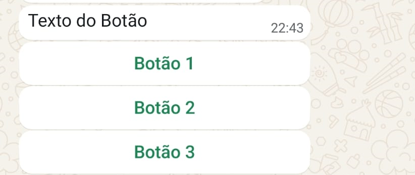
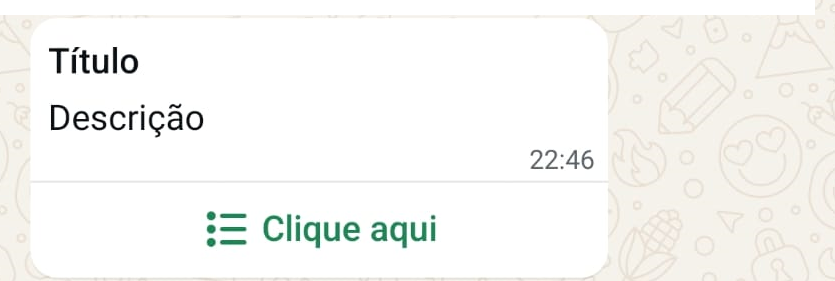
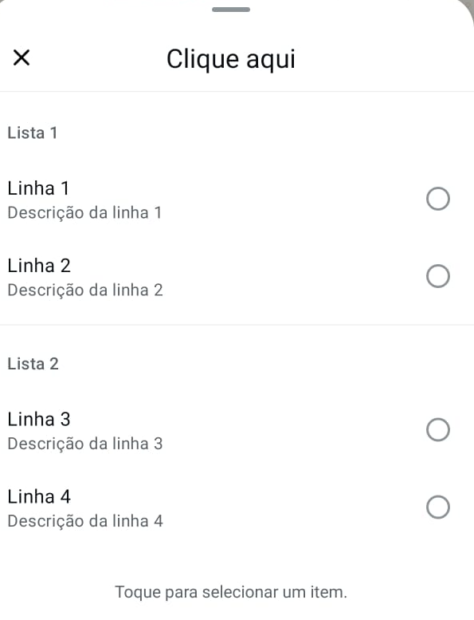
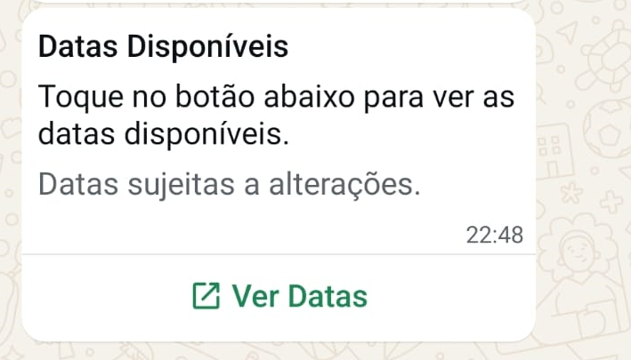
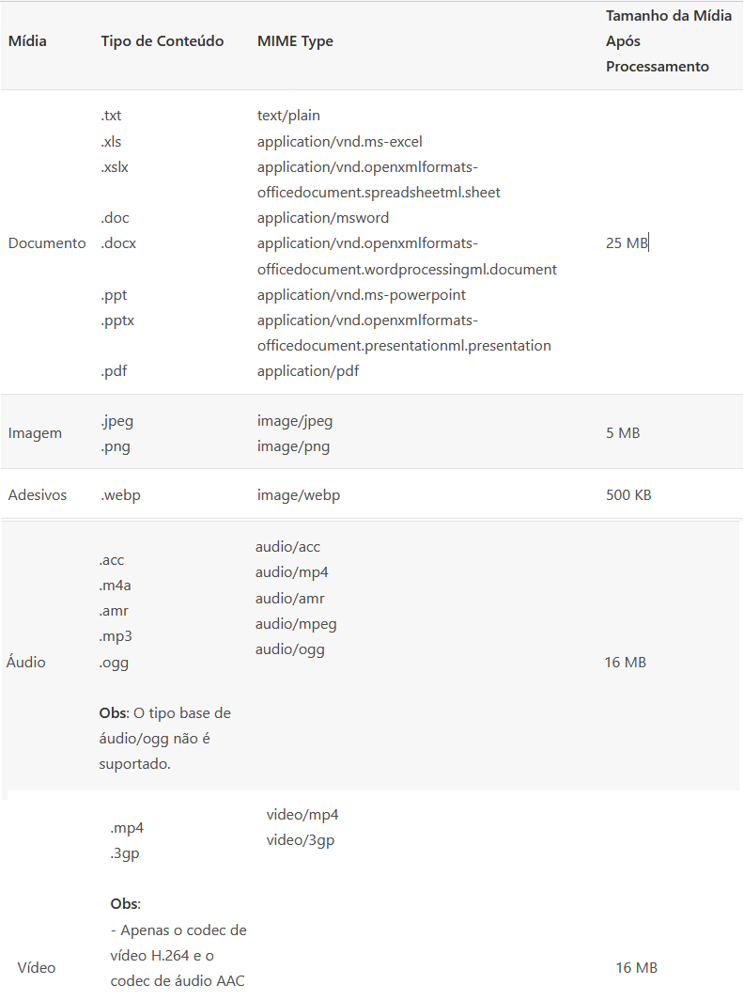

# SUPORTE API OFICIAL VIA HUB

- Api oficial será suportada versão grátis e na PREMIUM

### Valores

- Para ativar canal api oficial tem taxa R$ 120,00
- Após ativado não pode ser excluido caso de exclusão você perde taxa de ativação
- Em caso Banimento numero você perde taxa de ativação - sim api oficial tambem tem Banimento

- Mensalidade referente uso HUB - Cliente PREMIUM tem valor especial

### Considerações importantes

- Possivel conectar api oficial e manter o aplicativo no celular - Esse recurso ainda é beta
- Conectando api oficial mesmo mantendo aplicativo você não consigue mais conectar na api não oficial Baileys, Wavoip e no aplicativo executavel windows(inclusive esse caso seu cliente use não recebe mensagem dentro da api)
- Api oficial não suporta grupos - conectando so podera acessar grupos atraves do aplicativo ou no web - não será acessivel pelo whazing
- Modelo envio templates está pronto, mas como conectei via QRcode não consegui testar https://business.whatsapp.com/products/platform-pricing?lang=pt_BR&country=Brasil&currency=D%C3%B3lar%20(USD)&category=Utilit%C3%A1rios
- Api oficial não tem foto do contato

- Caso você envie uma mensagem pelo aplicativo celular ou web não tem custo para iniciar conversa e mensagens enviadas pelo aplicativo ou pela web não estaram disponiveis no whazing
- Você tem 24 horas responder cliente após ultima mensagem dele pelo whazing

- Versão QRCODE somente receptivo não da enviar template no momento esta faze beta. Por enquanto poderei desenvolver esses envios.
- Na versão QRCODE aconteceu problema perder primeira mensagem.

### Whazing tem suporte mensagens especiais da api OFICIAL

- Até 3 botões

- Lista

- Links com informações

 - Por onde posso enviar mensagens acima
 
 - Pelo Bot Interno - Totalmente personalizavel no bot Interno
 - Typebot - Será usado quando usado botões dentro fluxo - caso seja até 3 botões será usado botão mesmo, mais de 3 será usado listas, mensagens podera personalizada somente dentro da criação integração não será possivel personalizar dentro fluxo
 - Via API - Deixarei disponivel postman como enviar botões pela api - Lembrando para enviar tem estar dentro janela 24 horas respostas da meta
 
 [Download do POSTMAN API](postman.json)
 
 Modelo typebot com botões e http resquest envio link dentro fluxo
 
  [Typebot modelo com botão](typebotusobotao.json)
 
 
 ## Limites api oficial segue tabela abaixo
 
1. Para iniciar uma conversa com alguém, você precisa de um tipo específico de mensagem chamado mensagem de modelo, que requer aprovação antes de ser usada.

2. Ao enviar imagens PNG com fundo transparente, você pode obter um resultado final inesperado devido ao processamento de imagem realizado pelo WhatsApp para converter a imagem em JPEG.

3. Mensagens que não são do tipo conteúdo de modelo só podem ser entregues dentro de uma janela de 24 horas desde a última mensagem enviada pelo cliente para a empresa.
 
 
 
 ## Por que minha mensagem enviada tem x vermelho
 
  
  
  - Caso for enviada mensagem fora do prazo 24 horas ou um formato não aceito pela meta sistema vai indicar com esse x vermelho
  
 ## Suporte API
 
 - Podera ser usada api whazing envio de mensagens e arquivos do mesmo jeito que feito com api não oficial - Não será validado se numero tem whatsapp então tem colocar numero exato lebrando daquelas situação regiões tem 9 outras não - e deve respeitar a regra 24 horas após ultima mensagem do Cliente
 - Novo endpoint envio de botões
 
 ## Quero usar api iniciar conversa e fugir template da meta
 
 - Fiz testes iniciar conversa com api não oficial base wwjs que aquelas usam google chrome - Por se tratar apis muitos pesadas não será colocado direto whazing que afetara desempenho do sistema
 
 Fiz testes com https://github.com/devlikeapro/waha e https://github.com/avoylenko/wwebjs-api usando wwjs é possivel enviar mensagem fora da janela 24 horas
 
 - Lembrando praticar spam perde numero e perde taxa ativação feita no hub
 
 waha - Tem uma interface web, mas versão free não envia arquivos e somente aceita 1 conexão
 wwebjs-api - Somente via api rest, mas envia texto e arquivo e aceita varios canais
 
 Dentro sistema terá opção para fazer isso de forma automatica - modo fallback
 
 ## Para quem usar api oficial via leitura qrcode teremos modo fallback via wwebjs-api
 
 - Caso mensagem não for enviada pelo api oficial sistema tentara enviar via wwjs caso esteja configurada. Estou deixando documento separado de como configurar.
 
 ## Suporte Agendamento
 
 - Suporte enviar mensagem agendada lembrando que somente será enviada se tiver dentro prazo 24 horas da janela. Você pode usar essa opção forçar contato responder e manter janela aberta.