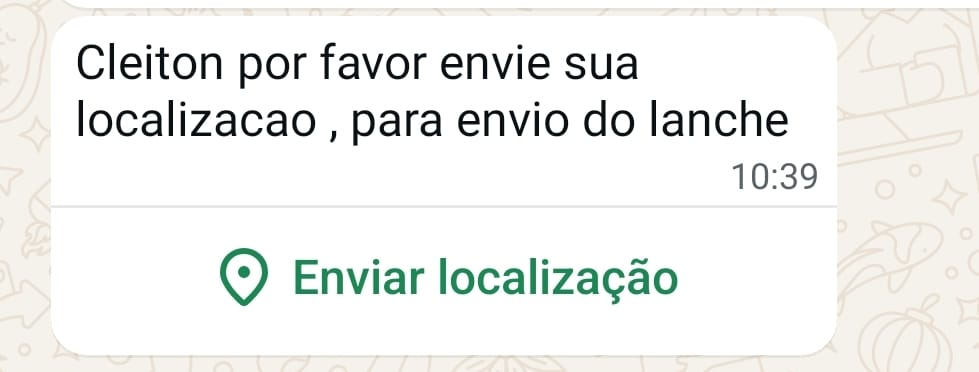

# SUPORTE API OFICIAL VIA HUB

A API oficial está disponível tanto na **versão gratuita** quanto para **clientes Premium**.

---

### 💵 Valores

- **Taxa de ativação do canal oficial:** R$ 120,00  
- Após ativado, **não poderá ser excluído**. Caso seja, a taxa de ativação será **perdida**.
- Em caso de **banimento do número**, a taxa de ativação também é **perdida** — sim, a API oficial **também pode ser banida**.
- Mensalidade de uso do Hub: **clientes Premium têm valor especial**.

---

### ⚠️ Considerações importantes

- É possível conectar a API oficial e manter o aplicativo do WhatsApp no celular (**recurso em fase Beta**).
- Após conectar com a API oficial, **não será mais possível usar a API não oficial** (como Baileys, Wavoip ou o app executável do Windows).  
  ➤ Caso o cliente esteja usando essas soluções, **ele não receberá mensagens da API oficial**.
- A API oficial **não oferece suporte a grupos**. O acesso será apenas pelo app ou WhatsApp Web — **não será possível acessar via Whazing**.
- O envio de templates está configurado, mas **ainda não testado com QR Code**.  
  ➤ [Tabela oficial de preços da Meta](https://business.whatsapp.com/products/platform-pricing?lang=pt_BR&country=Brasil&currency=D%C3%B3lar%20(USD)&category=Utilit%C3%A1rios)
- A API oficial **não exibe a foto do contato**.
- Mensagens enviadas via app ou Web **não geram custo**, mas **não aparecerão no Whazing**.
- Você tem **24 horas** para responder uma mensagem do cliente via Whazing.
- Versão QR Code é **somente receptiva**, **não envia templates** (fase Beta).  
  ➤ No momento, posso desenvolver esses envios manualmente.
- Na versão QR Code, há **falha ao receber a primeira mensagem**.

---

### ✅ Whazing tem suporte às mensagens especiais da API OFICIAL

- **Botões (até 3)**  
  

- **Lista**  
    
  

- **Links com informações**  
  
  
- **Solicitar localização**  
  

---

### 📤 Por onde posso enviar essas mensagens?

- **Bot Interno**: Totalmente personalizável.
- **Typebot**:
  - Até 3 botões → serão exibidos como botões.
  - Mais de 3 → serão convertidos em listas.
  - A personalização é feita **somente na integração**, não dentro do fluxo.
- **Via API**:
  - Envio de botões deve ser feito dentro da **janela de 24 horas** da Meta.
  - Postman com exemplos será disponibilizado.  
    ➤ [Download do POSTMAN API](postman.json)

- Modelo Typebot com botão e envio via HTTP request:  
  ➤ [Typebot modelo com botão](typebotusobotao.json)

---

## 📊 Limites da API Oficial

1. Para iniciar uma conversa, é necessário usar uma **mensagem de modelo**, que precisa de aprovação da Meta.
2. Imagens PNG com fundo transparente podem apresentar **alterações**, pois o WhatsApp converte para JPEG.
3. Mensagens fora do modelo só são entregues **dentro da janela de 24 horas** desde a última mensagem do cliente.

---

## ❌ Por que minha mensagem enviada tem um “X” vermelho?

- Isso ocorre quando:
  - A mensagem é enviada **fora da janela de 24 horas**, ou
  - O conteúdo está em **formato não aceito pela Meta**.

---

## ✉️ Envio de mensagens com API oficial via Whazing

- Funciona com envio de **mensagens e arquivos**, assim como na API não oficial.
- A API **não valida** se o número possui WhatsApp, então:
  - O número deve estar correto (DDD + 9º dígito, quando necessário).
  - Deve respeitar a **janela de 24 horas**.
- Novo endpoint disponível para **envio de botões**.

---

## 🚀 Quero iniciar conversa **sem usar templates da Meta**

- Fiz testes com APIs não oficiais que usam Google Chrome (baseadas no **wwjs**):
  - [waha](https://github.com/devlikeapro/waha): interface web, **não envia arquivos na versão gratuita** e só aceita uma conexão.
  - [wwebjs-api](https://github.com/avoylenko/wwebjs-api): API REST, envia **texto e arquivos** e aceita **vários canais**.
- Por serem pesadas, **não serão integradas diretamente ao Whazing**, para evitar impacto no desempenho.

- **Modo fallback será implementado** para enviar mensagens via wwjs caso a API oficial falhe.

---

## 🔁 Modo Fallback para API oficial via QR Code

- Se uma mensagem **não for enviada pela API oficial**, o sistema tentará enviar automaticamente via **wwebjs-api** (se estiver configurada).
- Um documento separado será disponibilizado explicando a configuração.

---

## ⏰ Suporte a Agendamento

- Mensagens agendadas **serão enviadas apenas dentro da janela de 24 horas**.
- Pode ser utilizado para forçar o contato a responder e manter a conversa ativa.