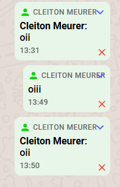
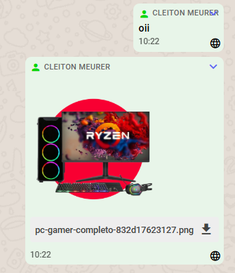
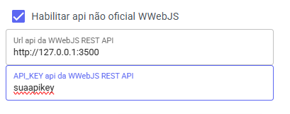
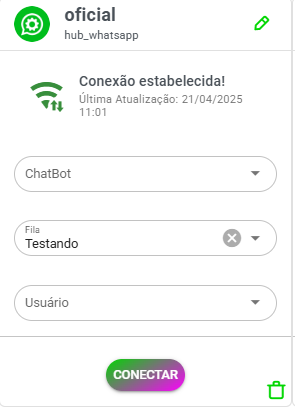

# Modo fallback

- Caso você usar api oficial com modelo ler qrcode mantem aplicativo teremos modo fallback ele tentara enviar usando wwjs

# Como vai funcionar

- Sistema tentara enviar via api oficial caso falhe vai altera para aquele x indicando falha



- Se estiver configurado wwjs o sistema ira tentar enviar por ele caso consiga vai atualizar icone para globo indicando foi enviado pelo wwjs




# Como instalar o wwebjs-api

   ```bash
docker run -d \
  --name wwebjs_api \
  -p 3500:3000 \
  --restart=always \
  -e ENABLE_LOCAL_CALLBACK_EXAMPLE=FALSE \
  -e MAX_ATTACHMENT_SIZE=10000000 \
  -e SET_MESSAGES_AS_SEEN=FALSE \
  -e "DISABLED_CALLBACKS=auth_failure|authenticated|call|change_state|disconnected|group_join|group_leave|group_update|loading_screen|media_uploaded|message|message_ack|message_create|message_reaction|message_revoke_everyone|qr|ready|contact_changed" \
  -e ENABLE_SWAGGER_ENDPOINT=FALSE \
  -e PUPPETEER_SKIP_CHROMIUM_DOWNLOAD=TRUE \
  -e NODE_ENV=production \
  -e API_KEY=suaapikey \
  -e ENABLE_WEBHOOK=FALSE \
  -e PORT=3000 \
  avoylenko/wwebjs-api
   ```
   
-   No comando acima ficara disponivel na porta 3500 e api key "suaapikey", altere conforme necessário

- Caso queira atualizar imagem

   ```bash
   # Puxar a última versão da imagem
docker pull avoylenko/wwebjs-api

# Remover o container antigo
docker rm -f wwebjs_api

# Recriar o container com a imagem atualizada
docker run -d \
  --name wwebjs_api \
  -p 3500:3000 \
  --restart=always \
  -e ENABLE_LOCAL_CALLBACK_EXAMPLE=FALSE \
  -e MAX_ATTACHMENT_SIZE=10000000 \
  -e SET_MESSAGES_AS_SEEN=FALSE \
  -e "DISABLED_CALLBACKS=auth_failure|authenticated|call|change_state|disconnected|group_join|group_leave|group_update|loading_screen|media_uploaded|message|message_ack|message_create|message_reaction|message_revoke_everyone|qr|ready|contact_changed" \
  -e ENABLE_SWAGGER_ENDPOINT=FALSE \
  -e PUPPETEER_SKIP_CHROMIUM_DOWNLOAD=TRUE \
  -e NODE_ENV=production \
  -e API_KEY=suaapikey \
  -e ENABLE_WEBHOOK=FALSE \
  -e PORT=3000 \
  avoylenko/wwebjs-api
      ```
	  
- Lembrando wwjs é api pesada pois usa navegaro vai ter consumo maior vps, dependendo caso pode instalar uma vps separada.

# Como configurar

- Acesse canais, clique no lapis edição canal



- Onde você preencher url da api wwjs, serviço pode estar instalado mesmo servidor sendo assim somente indicando http://127.0.0.1:porta não prescisa abrir porta firewall ou servidor externo colocando ip do mesmo http://ip:porta e servidor externo tem que esta porta aberta para whazing poder acessar.

- E API_KEY configurada na API

- Caso estiver configurado corretamente vai aparecer botão novo, de f5 para atualizar pagina caso necessário



- Você clica conectar para gerar conexão wwjs e depois vai aparecer botão qrcode wwebjs, caso apareça "QR Code não está pronto ou já foi escaneado" clique atualizar qr até aparecer codigo para leitura, após aparecer so ler qrcode no aplicativo na opção conectar whatsapp web.
Caso sistema conectar pagina vai atualizar e botão vai aparecer desconectar wwejs indicando conexão está funcionando.

## aviso

Não abuse dessa opção para disparar spam pois seu whatsapp pode ser banido