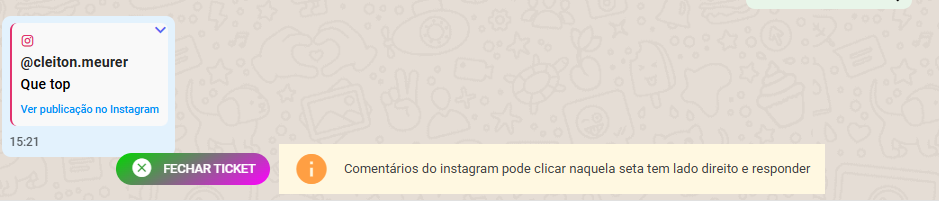
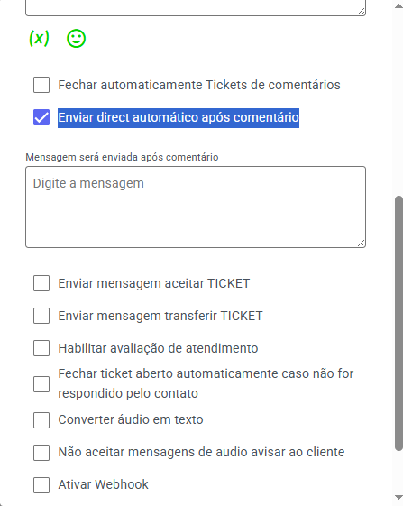

### Novidade: Responda Comentários no Instagram com Mais Facilidade

Agora você pode responder diretamente aos comentários recebidos no Instagram. Basta clicar na seta ao lado do texto do comentário para utilizar essa função.

💬 Mesmo que o ticket esteja pendente, a resposta pode ser enviada normalmente.  
⚠️ Importante: se não houver uma janela de conversa aberta com o cliente, **não será possível enviar uma mensagem direta (Direct)** em resposta ao comentário.

---

### Mensagem Direta Automática após Comentário no Instagram

Com essa nova funcionalidade, é possível enviar **uma mensagem direta automática** assim que um cliente comentar em uma publicação.  
Essa opção está disponível apenas para contatos **sem janela de conversa ativa**.

#### Como ativar:

1. Vá em **Configurações** > **Canais**.
2. Clique no ícone de lápis para **editar o canal do Instagram**.
3. Ative a opção **"Enviar Direct automático após comentário"**.

Depois, basta escrever a mensagem que será enviada automaticamente quando o comentário for recebido.