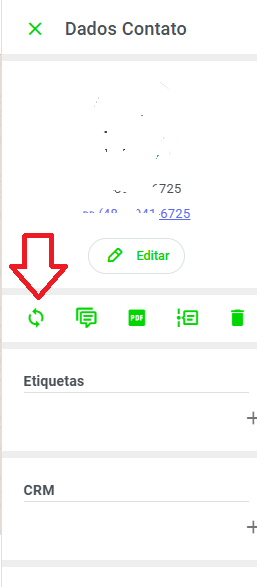

# SINCRONIZAR MENSAGENS

- Cadastrar contato - caso não tenha
- Abrir novo ticket - caso não tenha algum aberto

- Aparece pedindo quantidade de mensagens maximo 100, caso encontrar as mensagens elas começaram ser baixadas