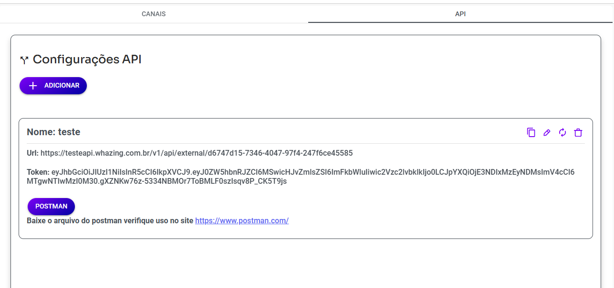

# Manual de Uso da API Whazing



- Faça o [download do arquivo modelo](apiizing.json)

## Índice
1. [Introdução](#introdução)
2. [Autenticação](#autenticação)
3. [Endpoints](#endpoints)
   - [Mensagens](#mensagens)
   - [Contatos](#contatos)
   - [Tickets](#tickets)
   - [Mensagens Interativas](#mensagens-interativas)
   - [Templates](#templates)
   - [Outros Endpoints](#outros-endpoints)
4. [Exemplos de Código](#exemplos-de-código)

## Introdução

A API do Whazing permite a integração com o WhatsApp Business API para envio e gerenciamento de mensagens, contatos e tickets.

- **Base URL**: `https://testeapi.whazing.com.br/v1/api/external/[SEU-ID]`
- **ExternalKey**: Identificador único para cada mensagem (pode ser qualquer valor e aparece no webhook na apiConfig)

## Autenticação

Todas as requisições devem incluir o token Bearer no header:

```http
Authorization: Bearer seu-token-aqui
```

## Endpoints

### Mensagens

#### 1. Enviar Mensagem de Texto
- **Método**: POST
- **Endpoint**: `/`
- **Content-Type**: application/json

```json
{
    "body": "Sua mensagem aqui",
    "number": "5511999999999",
    "externalKey": "ID_UNICO_SISTEMA"
}
```

#### 2. Enviar Arquivo
- **Método**: POST
- **Endpoint**: `/`
- **Content-Type**: multipart/form-data

```json
{
    "media": "(arquivo)",
    "body": "Texto da mensagem",
    "number": "5511999999999",
    "externalKey": "ID_UNICO_SISTEMA"
}
```

#### 3. Enviar Sticker
- **Método**: POST
- **Endpoint**: `/`
- **Content-Type**: multipart/form-data

```json
{
    "media": "(arquivo)",
    "body": "sticker",
    "number": "5511999999999",
    "externalKey": "ID_UNICO_SISTEMA",
    "sticker": "true"
}
```

#### 4. Enviar Localização
- **Método**: POST
- **Endpoint**: `/location`

```json
{
  "number": "5511999999999",
  "contents": {
    "type": "location",
    "longitude": -27.2842864,
    "latitude": -48.9243959,
    "name": "Nome do Local",
    "address": "Endereço Completo"
  }
}
```

#### 5. Enviar Mensagem via Parâmetros
- **Método**: GET
- **Endpoint**: `/params`

```
/params/?body=Mensagem&number=5511999999999&externalKey=ID_UNICO&bearertoken=seu-token
```

### Contatos

#### 1. Criar Contato
- **Método**: POST
- **Endpoint**: `/createcontact`

```json
{
  "name": "Nome do Contato",
  "number": "5511999999999",
  "email": "email@exemplo.com",
  "extraInfo": [
    {
      "name": "Campo Extra",
      "value": "Valor"
    }
  ],
  "wallets": [],
  "disableBot": false,
  "disableCampaign": false,
  "commentary": "Observações",
  "deadline": "2025-12-31T23:59:59Z",
  "disableKanban": false,
  "kanbanPrice": "1500",
  "ignore": false
}
```

#### 2. Buscar Contato
- **Método**: POST
- **Endpoint**: `/contact`

Por número:
```json
{
  "number": "5511999999999"
}
```

Por ID:
```json
{
  "contactId": 123
}
```

#### 3. Atualizar CRM do Contato
- **Método**: POST
- **Endpoint**: `/updatecrm`

Por número:
```json
{
  "number": "5511999999999",
  "crm": 1
}
```

Por contactId:
```json
{
  "contactId": 3397,
  "crm": 8
}
```

Por ticketId:
```json
{
  "ticketId": 2881,
  "crm": 19
}
```

Para retirar contato do crm use valor 0

#### 4. Atualizar Tags do Contato
- **Método**: POST
- **Endpoint**: `/updatetag`

Por número:
```json
{
  "number": "5511999999999",
  "tags": [25, 26]
}
```

Por contactId:
```json
{
  "contactId": 3649,
  "tags": [25]
}
```

Por ticketId:
```json
{
  "ticketId": 3183,
  "tags": []
}
```

Caso usar [] vai retirar tags. Esse valor altera para tags que você colocar no endpoint tags anteriores são removidas.

#### 5. Editar Contato
- **Método**: POST
- **Endpoint**: `/updatecontact`

Pode ser usado "number": "5511999999999" ou "contactId": "5219" para localizar contato a ser alterado

```json
{
  "name": "Nome do Contato",
  "number": "5511999999999",
  "email": "email@exemplo.com",
  "extraInfo": [
    {
      "name": "Campo Extra",
      "value": "Valor"
    }
  ],
  "wallets": [],
  "disableBot": false,
  "disableCampaign": false,
  "commentary": "Observações",
  "deadline": "2025-12-31T23:59:59Z",
  "disableKanban": false,
  "kanbanPrice": "1500",
  "ignore": false
}
```

### Tickets

#### 1. Criar Ticket
- **Método**: POST
- **Endpoint**: `/createticket`

```json
{
  "number": "5511999999999",
  "status": "pending",
  "queueId": 4,
  "userId": null
}
```

#### 2. Consulta ultimo Ticket atribuido ao canal
- **Método**: POST
- **Endpoint**: `/showticket`

```json
{
  "number": "5511999999999"
}
```

#### 3. Consultar Ticket ChatBot
- **Método**: POST
- **Endpoint**: `/showticketchatbot`

```json
{
  "number": "5511999999999"
}
```

#### 4. Consultar Todos os Tickets atribuidos ao canal
- **Método**: POST
- **Endpoint**: `/showallticket`

```json
{
  "number": "5511999999999"
}
```

#### 5. Atualizar Ticket
- **Método**: POST
- **Endpoint**: `/updateticketinfo`

```json
{
  "ticketId": 1003,
  "status": "open",
  "userId": 1,
  "queueId": null
}
```

#### 6. Atualizar Fila do Ticket
- **Método**: POST
- **Endpoint**: `/updatequeue`

```json
{
  "ticketId": 4,
  "queueId": 1
}
```

#### 7. Listar todas mensagens do ticket
- **Método**: GET
- **Endpoint**: `/ticket/{ticketId}`

### Mensagens Interativas

#### 1. Mensagem com Botões
- **Método**: POST
- **Endpoint**: `/apioficial`

```json
{
    "number": "5511999999999",
    "contents": {
        "type": "button",
        "body": {
            "text": "Texto principal"
        },
        "action": {
            "buttons": [
                {
                    "type": "reply",
                    "reply": {
                        "id": "1",
                        "title": "Botão 1"
                    }
                }
            ]
        }
    }
}
```

#### 2. Mensagem com Lista
- **Método**: POST
- **Endpoint**: `/apioficial`

```json
{
  "number": "5511999999999",
  "contents": {
    "type": "list",
    "header": {
      "type": "text",
      "text": "Título"
    },
    "body": {
      "text": "Descrição"
    },
    "action": {
      "sections": [
        {
          "title": "Seção 1",
          "rows": [
            {
              "id": 1,
              "title": "Item 1",
              "description": "Descrição do item 1"
            }
          ]
        }
      ],
      "button": "Clique aqui"
    }
  }
}
```

#### 3. Mensagem com Link (CTA)
- **Método**: POST
- **Endpoint**: `/apioficial`

```json
{
    "number": "5511999999999",
    "contents": {
        "type": "cta_url",
        "header": {
            "type": "text",
            "text": "Título"
        },
        "body": {
            "text": "Descrição"
        },
        "footer": {
            "text": "Rodapé"
        },
        "action": {
            "name": "cta_url",
            "parameters": {
                "display_text": "Ver Mais",
                "url": "SEU_LINK"
            }
        }
    }
}
```

#### 4. Solicitar Localização
- **Método**: POST
- **Endpoint**: `/apioficial`

```json
{
    "number": "5511999999999",
    "contents": {
        "type": "location_request_message",
        "body": {
            "text": "Por favor compartilhe sua localização"
        },
        "action": {
            "name": "send_location"
        }
    }
}
```

### Templates

#### 1. Template Simples
- **Método**: POST
- **Endpoint**: `/apioficial`

```json
{
    "number": "5511999999999",
    "contents": {
        "name": "nome_do_template",
        "components": [{
            "type": "body",
            "parameters": []
        }],
        "language": {
            "code": "pt_BR"
        }
    }
}
```

#### 2. Template com Parâmetros
- **Método**: POST
- **Endpoint**: `/apioficial`

```json
{
    "number": "5511999999999",
    "contents": {
        "name": "nome_do_template",
        "components": [
            {
                "type": "header",
                "parameters": [{
                    "type": "image",
                    "image": {
                        "link": "link_da_imagem"
                    }
                }]
            },
            {
                "type": "body",
                "parameters": [
                    {
                        "type": "text",
                        "parameter_name": "nome_do_parametro",
                        "text": "texto_do_parametro"
                    }
                ]
            },
            {
                "type": "button",
                "sub_type": "tipo_do_botão",
                "index": "index_do_botão",
                "parameters": []
            }
        ],
        "language": {
            "code": "pt_BR"
        }
    }
}
```

### Outros Endpoints

#### 1. Validar Número WhatsApp
- **Método**: POST
- **Endpoint**: `/valid-whatsapp-number`

```json
{
  "number": "5511999999999"
}
```

#### 2. Status do Canal
- **Método**: GET
- **Endpoint**: `/statuschannel`

#### 3. QR Code
- **Método**: POST
- **Endpoint**: `/qrcode`

```json
{
  "number": null
}
```

#### 4. Listar Contatos por Filtro
- **Método**: GET
- **Por Tag**: `/contacts/tag/{tagId}`
- **Por CRM**: `/contacts/crm/{crmId}`
- **Por Carteira**: `/contacts/wallet/{walletId}`

## Exemplos de Código

### Python
```python
import requests
import json

class WhazingAPI:
    def __init__(self, base_url, token):
        self.base_url = base_url
        self.headers = {
            'Authorization': f'Bearer {token}',
            'Content-Type': 'application/json'
        }

    def send_message(self, number, body, external_key):
        payload = {
            'number': number,
            'body': body,
            'externalKey': external_key
        }
        response = requests.post(self.base_url, 
                               headers=self.headers, 
                               json=payload)
        return response.json()

    def send_file(self, number, file_path, body, external_key):
        files = {
            'media': open(file_path, 'rb'),
            'body': (None, body),
            'number': (None, number),
            'externalKey': (None, external_key)
        }
        headers = {'Authorization': f'Bearer {self.headers["Authorization"]}'}
        response = requests.post(self.base_url, 
                               headers=headers, 
                               files=files)
        return response.json()
```

### Node.js
```javascript
const axios = require('axios');
const FormData = require('form-data');
const fs = require('fs');

class WhazingAPI {
    constructor(baseUrl, token) {
        this.baseUrl = baseUrl;
        this.token = token;
    }

    async sendMessage(number, body, externalKey) {
        try {
            const response = await axios.post(
                this.baseUrl,
                {
                    number,
                    body,
                    externalKey
                },
                {
                    headers: {
                        'Authorization': `Bearer ${this.token}`,
                        'Content-Type': 'application/json'
                    }
                }
            );
            return response.data;
        } catch (error) {
            throw error;
        }
    }

    async sendFile(number, filePath, body, externalKey) {
        const form = new FormData();
        form.append('media', fs.createReadStream(filePath));
        form.append('body', body);
        form.append('number', number);
        form.append('externalKey', externalKey);

        try {
            const response = await axios.post(
                this.baseUrl,
                form,
                {
                    headers: {
                        'Authorization': `Bearer ${this.token}`,
                        ...form.getHeaders()
                    }
                }
            );
            return response.data;
        } catch (error) {
            throw error;
        }
    }
}
```

### PHP
```php
<?php

class WhazingAPI {
    private $baseUrl;
    private $token;

    public function __construct($baseUrl, $token) {
        $this->baseUrl = $baseUrl;
        $this->token = $token;
    }

    public function sendMessage($number, $body, $externalKey) {
        $curl = curl_init();
        
        $data = [
            'number' => $number,
            'body' => $body,
            'externalKey' => $externalKey
        ];

        curl_setopt_array($curl, [
            CURLOPT_URL => $this->baseUrl,
            CURLOPT_RETURNTRANSFER => true,
            CURLOPT_POST => true,
            CURLOPT_POSTFIELDS => json_encode($data),
            CURLOPT_HTTPHEADER => [
                'Authorization: Bearer ' . $this->token,
                'Content-Type: application/json'
            ]
        ]);

        $response = curl_exec($curl);
        curl_close($curl);

        return json_decode($response, true);
    }

    public function sendFile($number, $filePath, $body, $externalKey) {
        $curl = curl_init();
        
        $data = [
            'media' => new CURLFile($filePath),
            'body' => $body,
            'number' => $number,
            'externalKey' => $externalKey
        ];

        curl_setopt_array($curl, [
            CURLOPT_URL => $this->baseUrl,
            CURLOPT_RETURNTRANSFER => true,
            CURLOPT_POST => true,
            CURLOPT_POSTFIELDS => $data,
            CURLOPT_HTTPHEADER => [
                'Authorization: Bearer ' . $this->token
            ]
        ]);

        $response = curl_exec($curl);
        curl_close($curl);

        return json_decode($response, true);
    }
}
```

## Observações Importantes

1. Todos os números devem estar no formato DDI+DDD+NÚMERO (ex: 5511999999999)
2. O token de autenticação deve ser mantido em segurança
3. Para mensagens em grupo, use o formato "nome-do-grupo@grupo" no campo number
4. Os templates devem ser previamente aprovados pelo WhatsApp
5. Mantenha o externalKey único para cada mensagem para rastreamento
6. Certifique-se de que os arquivos enviados estejam em formatos suportados pelo WhatsApp
7. Para endpoints que aceitam status, os valores possíveis são: "pending", "open", "closed"
8. Os IDs de fila (queueId) e usuário (userId) devem existir no sistema

Para casos específicos ou dúvidas adicionais, consulte a documentação completa ou entre em contato com o suporte.