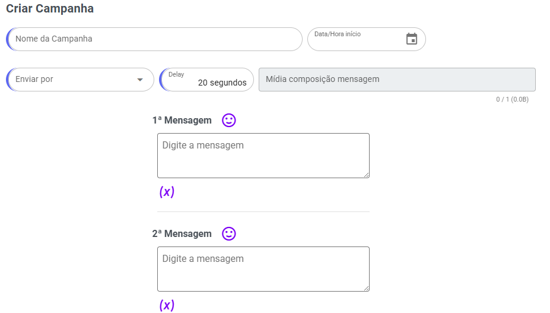
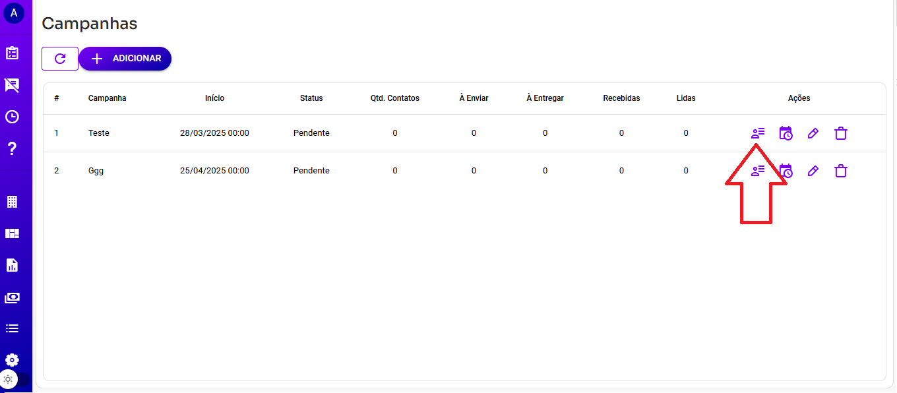
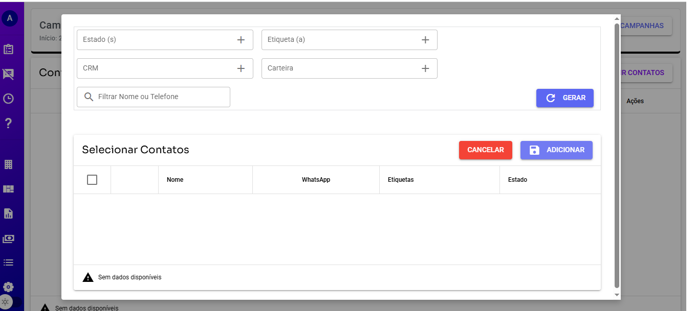
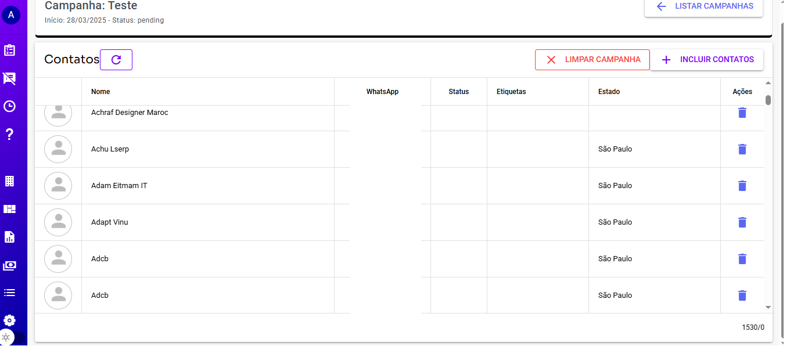
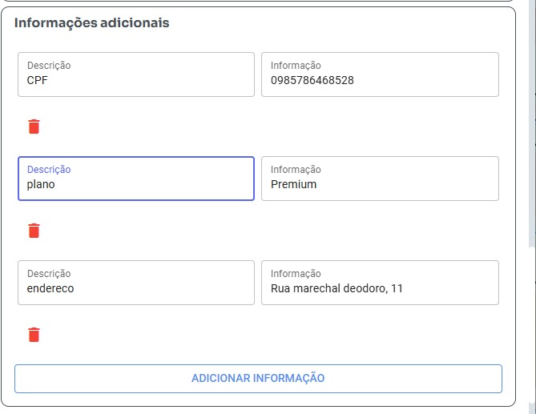

# **Como Enviar Campanhas no Whazing**

Atualmente, as campanhas funcionam apenas no canal **WhatsApp**.

---

## Etapa 1: Configuração da Campanha



- **Nome da Campanha**: Escolha um nome para diferenciar sua campanha. Esse campo não influencia no envio das mensagens.
- **Data e Hora de Início**: Informe a data e o horário em que o envio das mensagens será iniciado.
- **Enviar por**: Selecione o WhatsApp que será utilizado para o envio.
- **Delay**: Defina o tempo de intervalo entre o envio das mensagens.
- **Mídia**: Adicione um arquivo que será enviado junto com a mensagem, se necessário.
- **Mensagens (1, 2, 3)**: Configure 3 mensagens diferentes. Uma mensagem será escolhida aleatoriamente para cada contato, reduzindo a chance de bloqueio pelo WhatsApp.

Depois de preencher todos os campos, clique em **Salvar**. Em seguida, vá para a próxima etapa, onde adicionaremos os contatos.

---

## Etapa 2: Adicionando Contatos

### Incluir Contatos



1. Clique no botão **Incluir Contatos**.
2. Utilize os filtros disponíveis para selecionar os contatos mais adequados para a campanha.
3. Clique em **Gerar**. Dependendo da quantidade de contatos, a lista pode levar algum tempo para ser exibida.
4. Selecione os contatos desejados na lista gerada e clique em **Adicionar**.



Caso precise adicionar mais contatos, repita o processo acima. Após adicionar todos os contatos, clique em **Listar Campanhas** para retornar à tela anterior.

---

## Etapa 3: Programação e Envio



1. Após revisar os detalhes da campanha, clique em **Programar Envio**.
2. A partir deste momento, basta aguardar o envio ser executado conforme a configuração realizada.

### Suporta Variáveis Dinâmicas

As variáveis dinâmicas usam os dados das Informações Adicionais dos Contatos.

### Exemplo

>

1. Usando a variável abaixo, o valor retornado será "0985786468528":
   ```bash
   {{CPF}}
   ```

2. Usando a variável abaixo, o valor retornado será "Premium":
   ```bash
   {{plano}}
   ```

3. Usando a variável abaixo, o valor retornado será "Rua Marechal Deodoro, 11":
   ```bash
   {{endereco}}
   ```