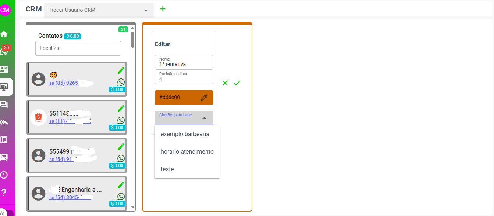
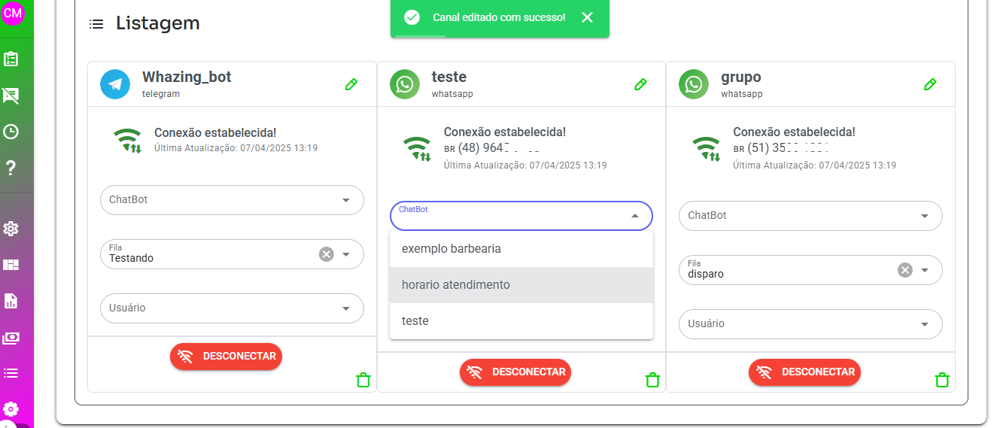
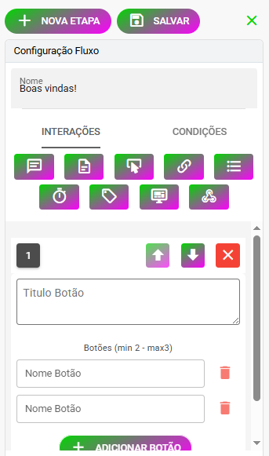
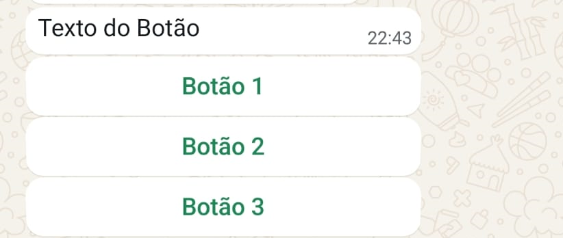
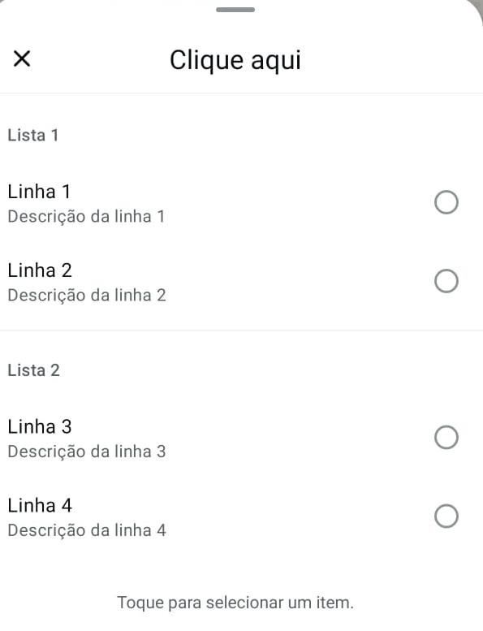
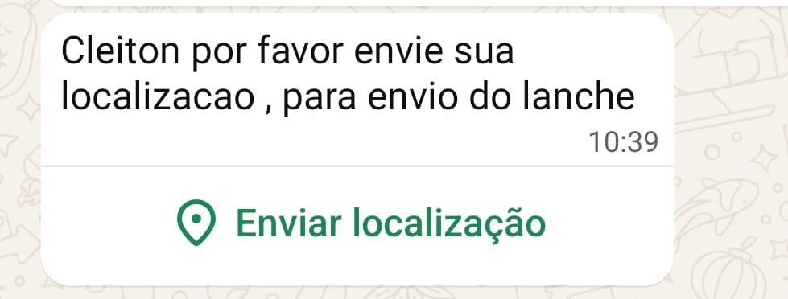
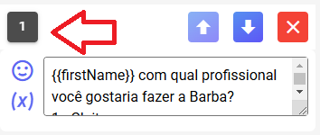
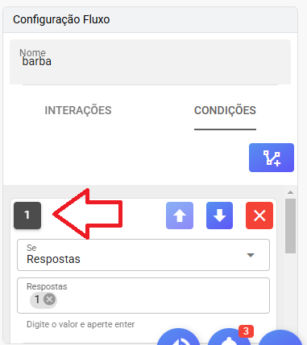
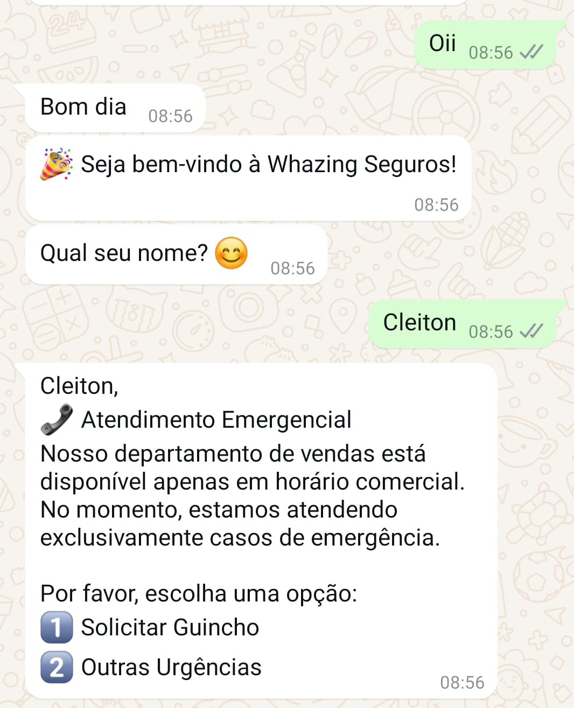
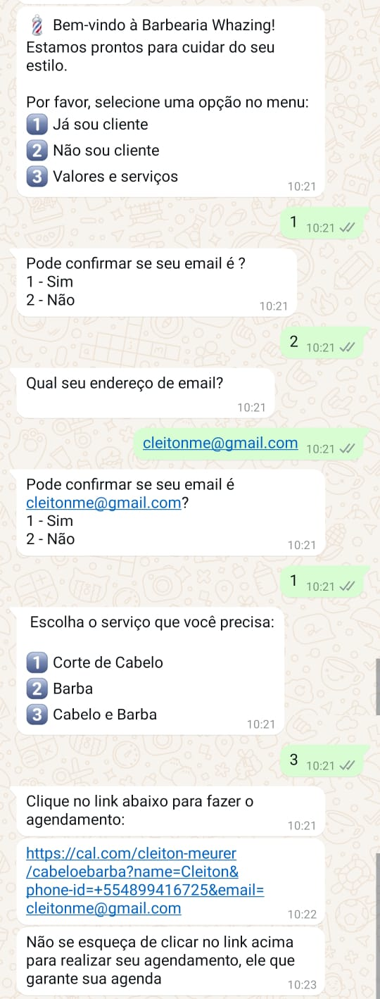

# Guia de Configuração do Chatbot Interno

### Locais escolhe qual bot será usado e prioridades

Atualmente, há três critérios que determinam qual bot será usado para novos tickets. Esses critérios estão listados abaixo em ordem de prioridade:

1 -    Lane do CRM Todos os contatos associados a uma lane específica do CRM. Ao enviar uma mensagem para o número do sistema, caso não haja tickets abertos ou pendentes, o bot configurado para essa lane será acionado.



2 - Palavra chave - Exemplo: Ao cadastrar a palavra-chave "comprar" e o cliente enviar "Eu quero comprar", a mensagem será encaminhada para o bot correspondente.

3 -    No canal Cada canal pode ter um bot configurado. Ao enviar uma mensagem para o número do sistema, caso não haja tickets abertos ou pendentes, o bot configurado para aquele canal será utilizado.



4 -    Nas Configurações Se nenhum bot for identificado pelas configurações acima, será utilizado o bot configurado no fluxo ativo do sistema.

Esse ordem acima de prioridades define qual bot será escolhido quando for recebida uma mensagem pelo canal e não tiver ticket aberto ou pendente.

É importante configurar os bots corretamente em cada nível para garantir que o atendimento ao cliente seja realizado conforme esperado.


## Índice
1. [Configuração de Fluxo](#configuração-de-fluxo)
2. [Ordem das Interações](#ordem-das-interações)
3. [Configuração de Condições](#configuração-de-condições)
4. [Exemplos Práticos de Fluxos](#exemplos-práticos-de-fluxos)

## Configuração de Fluxo

A configuração do fluxo do chatbot é feita através da interface visual abaixo:


### Elementos Básicos de Configuração



Na versão 2.9.1, você tem acesso às seguintes interações:

#### 1. Enviar Mensagem
- Permite inserir o texto que será enviado ao cliente
- Suporta o uso de variáveis (consulte a seção de variáveis para mais detalhes)

#### 2. Enviar Documentos, Vídeos, Áudios e Outros Arquivos
- Funcionalidade dedicada para envio de arquivos diversos

#### 3. Enviar figurinhas
- Funcionalidade dedicada para envio de figurinhas qualquer imagem usada será convertida em uma figurinha

#### 4. Enviar localização
- Enviar localizacação para o contato somente funciona whatsapp api oficial ou baileys

#### 5. Enviar Botões
- Compativel com api oficial, facebook e instagram - máximo 3 botões



#### 6. Adicionar botão com Link
- Compativel com api oficial


#### 7. Adicionar lista
- Compativel com api oficial




#### 8. Solicitar localização - somente api oficial
- Envia botão pedindo para cliente localizacação dele, util serviços de entrega por exemplo



#### 8. Adicionar Delay
- Configure o intervalo de tempo (em segundos) entre as mensagens
- Importante para garantir a sequência correta das mensagens

#### 9. Adicionar Tag
- Permite marcar o contato com uma etiqueta específica

#### 10. Adicionar CRM
- Move contato para lane no crm compartilhado

#### 11. Adicionar Webhook (GET)
- Integração com sistemas externos
- Útil para enviar informações capturadas durante o atendimento

## Ordem das Interações



### Importante:
- Os números indicam a sequência exata de execução das interações
- Para múltiplas mensagens, use sempre o delay entre elas para garantir a ordem correta de envio

## Configuração de Condições



### Tipos de Condições (em ordem de prioridade):

#### 1. Dentro/Fora do Horário de Atendimento
- Essa condição somente funciona na etapa "Boas vindas!"
- **Posicionamento**: Sempre no início das condições
- **Dentro do Horário**: Ativa durante o horário comercial
- **Fora do Horário**: Ativa fora do horário comercial

#### 2. Respostas Exatas
- Exemplo: "1" ou "01"
- A resposta deve ser idêntica ao configurado
- Não reconhece variações como "quero 1"

#### 3. Contém Exato
- Procura palavras específicas na frase
- Exemplo: Para "quero comprar", reconhece "Eu quero comprar um tênis"

#### 4. Contém
- Reconhece palavras ou partes de palavras
- Exemplo: "compra" reconhece "comprando", "comprador"

#### 5. Qualquer Resposta
- **Posicionamento**: Sempre por último
- Captura qualquer resposta não prevista nas condições anteriores

### Tratamento de Respostas Inesperadas
Se nenhuma condição for atendida, o bot responderá com:
"Desculpe! Não entendi sua resposta. Vamos tentar novamente! Escolha uma opção válida."
(Esta mensagem pode ser personalizada nas configurações)

## Exemplos Práticos de Fluxos

### 1. Fluxo com Horário de Atendimento
Ideal para empresas com plantão de emergência




[Download do Fluxo de Exemplo](horario_de_atendimento.json)

### 2. Fluxo com Variáveis Dinâmicas
Permite personalizar mensagens com dados do cliente

[Download do Fluxo de Exemplo](exemplo_fluxo_usando_novas_variaveis.json)

#### Exemplo de Uso:
```
Template da mensagem:
Por favor, confirme se seu endereço é {{endereco}}?
1 - Sim
2 - Não

Mensagem enviada ao cliente:
Por favor, confirme se seu endereço é Rua Marechal Deodoro, 11?
1 - Sim
2 - Não
```

### 3. Fluxo de Agendamento com Cal.com
Sistema integrado com [https://cal.com/](https://cal.com/)



[Download do Fluxo de Exemplo](agendamentobarbearia.json)