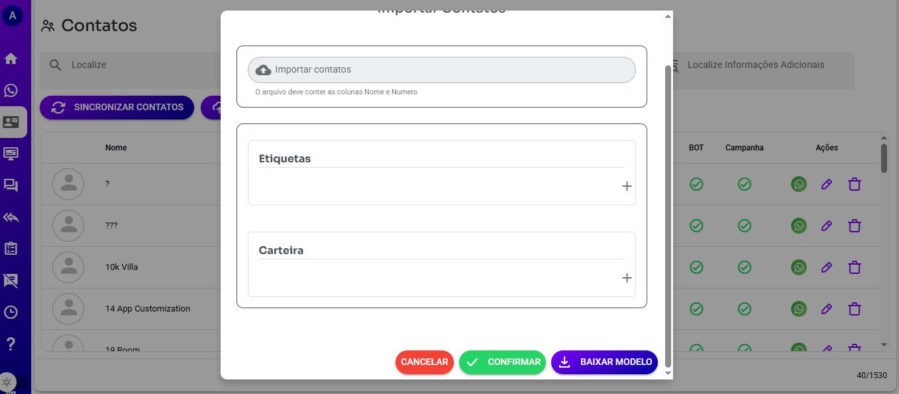

# 📥 **Como Importar Contatos Usando um Arquivo CSV no WHAZING**

Facilite o cadastro em massa dos seus contatos no WHAZING utilizando um arquivo `.csv` no formato correto.

---

## 🛠️ **1. Baixe e Edite o Arquivo Modelo**

- 📥 Faça o [**download do arquivo modelo**](modelo.csv).
- 📝 Ao abrir o arquivo em um editor de texto (ex: Bloco de Notas ou Notepad++), ele deve seguir o seguinte formato:

```csv
nome;numero;email
User;5551900000;email@email.com
```

- 🔢 **Atenção:** o número de telefone deve incluir o código do país (ex: `55` para Brasil).

- 💾 Certifique-se de:
  - Utilizar ponto e vírgula (`;`) como separador.
  - Salvar o arquivo no formato CSV, codificado em UTF-8.

> ⚠️ Se usar o Excel, lembre-se de salvar como **CSV delimitado por ponto e vírgula** (`CSV (Separado por ponto e vírgula) (*.csv)`).

---

## 🚀 **2. Importando o Arquivo no WHAZING**

1. No menu lateral, acesse **Contatos** > **Importar**.
2. Clique em **Selecionar Arquivo** e envie o seu `.csv`.
3. (Opcional) Configure os dados extras:
   - 🧳 **Carteira:** vincule os contatos a uma carteira específica.
   - 🏷️ **Etiquetas:** adicione etiquetas (tags) aos contatos.
   - 📋 **CRM:** adicione os contatos diretamente a um CRM existente (disponível apenas se o CRM for compartilhado).

📸 Exemplo da tela de importação:



---

# 📌 Observações

- ✅ Arquivos fora do padrão podem causar falhas na importação.
- ✅ Revise os dados antes de enviar para evitar duplicidade de contatos.
- ✅ Ideal sempre usar editores que respeitem a formatação CSV com ponto e vírgula.

> 💬 Em caso de dúvidas, consulte nossa documentação oficial ou tire duvidas nosso grupo suporte https://grupo.whazing.com.br.