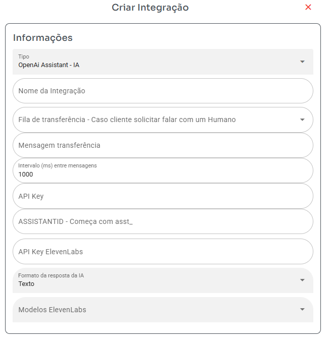
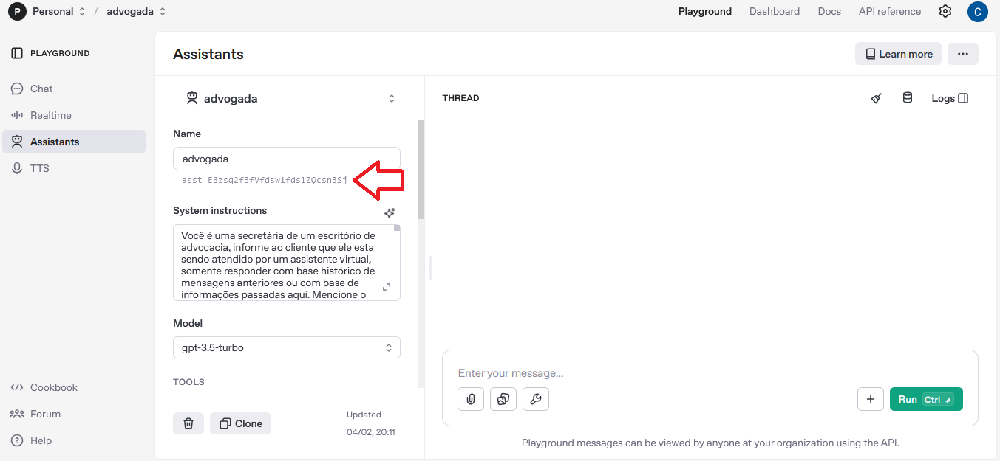

## ChatGPT Assistant

### Por que escolher essa integração?
- Você obterá uma IA mais ajustada para melhores resultados.

### Alguns vídeos sobre esse modelo de configuração:
- [Vídeo 1](https://www.youtube.com/watch?v=N2Ynpl16o4I)
- [Vídeo 2](https://www.youtube.com/watch?v=3A4rdBnCJPA)

### Configurar ChatGPT Assistant

1. **Fila**: Selecione a fila para a qual a IA deve transferir caso não consiga responder às perguntas ou resolver o problema.
2  **Mensagem de transferencia**: Mensagem será enviado cliente caso ele pedir falar com um humano
3. **Intervalo (ms) entre mensagens**: Defina o tempo entre as respostas da IA. Por exemplo, 1000ms = 1 segundo.
4. **API Key**: Chave de API para conexão com a IA. Lembre-se que o ChatGPT cobra por token. Obtenha sua chave [aqui](https://platform.openai.com/settings/organization/api-keys).
5. **ASSISTANT ID**: Identificação do assistente (começa com `asst_`). Obtenha seu ID [aqui](https://platform.openai.com/playground/assistants).

   - Ao criar o assistente, o formato da resposta deve ser **texto**.

### Formato da Resposta da IA

- **API Key ElevenLabs**: Necessária se o formato da resposta for diferente de texto.
- **Formato da resposta da IA**: Selecione voz da ElevenLabs deseja usar tem que preencher api key acima antes
- **Modelos ElevenLabs**: Selecione modelo de voz para usar