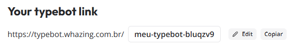
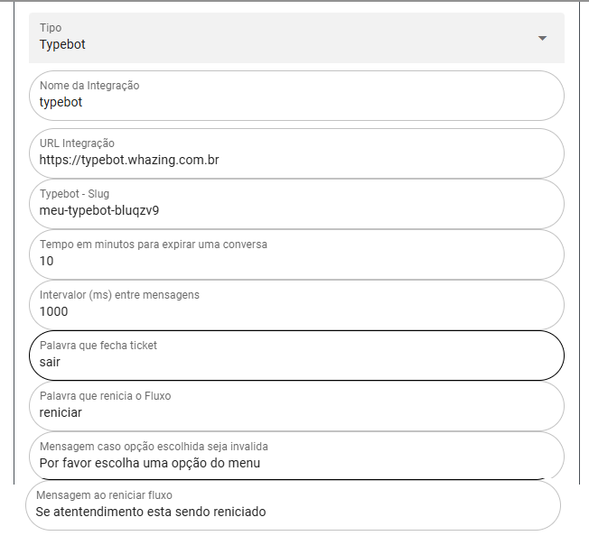

## Configurar Typebot 




1. **URL Integração**: Pegue a URL na publicação do Typebot, não coloque a última `/` conforme exemplo acima.
2. **Typebot - Slug**: Nome que aparece depois na URL quando você publica. Ver exemplo acima.
3. **Tempo em minutos para expirar uma conversa**: Tempo de inatividade que leva para o Whazing se desconectar do Typebot caso não haja mais interação do cliente.
4. **Intervalo (ms) entre mensagens**: Tempo entre as respostas da IA. 1000ms = 1 segundo.
5. **Palavra que fecha ticket**: Comando que o cliente envia para fechar o ticket.
6. **Palavra que reinicia o Fluxo**: Comando que o cliente envia para voltar ao começo do fluxo do Typebot.
7. **Mensagem caso opção escolhida seja inválida**: Mensagem que o bot enviará caso não receba a resposta esperada (exemplo: o cliente envia texto quando a entrada esperada era um número).
8. **Mensagem ao reiniciar fluxo**: Mensagem que será enviada após o comando que reinicia o fluxo.

### Variáveis do Typebot

- **number**
- **pushName**
- **nome**
- **email**
- **ticketId**
- **protocol**
- **ticket**
- **remoteJid**
- **firstMessage**

### Comandos Possíveis

Adicione os comandos abaixo em um Bubble de texto:

- Comando para transferir de Fila (lembre-se de trocar o ID):
   ```bash
   #{ "queueId": "1" }
   ```
- Comando para transferir para Atendente (lembre-se de trocar o ID):
   ```bash
   #{ "queueId":"1", "userId":"1" }
   ```
- Parar o Typebot (não precisa trocar o 1):
   ```bash
   #{ "stopBot":"1" }
   ```
- Comando para adicionar uma Etiqueta (lembre-se de trocar o ID):
   ```bash
   #{ "tagId": "1" }
   ```
- Comando para finalizar o atendimento (não precisa trocar o 1):
   ```bash
   #{ "closeTicket":"1" }
   ```
   
- Comando para adicionar contato em uma Lane CRM - Somente crm compartilhado (lembre-se de trocar o ID):
   ```bash
   #{ "crmId": "1" }
   ```

Os IDs podem ser obtidos na tela que lista os cadastros no Whazing.

**IMPORTANTE**: 
- Veja como instalar o Typebot na mesma VPS que o Whazing [aqui](Comoinstalar.md).

### Exemplo de fluxo para importar no Typebot

- [Baixe e importe o exemplo de fluxo compatível com o Whazing](exemplo-fluxo-typebot.json).

### Como Compartilhar Fluxo com o Cliente

